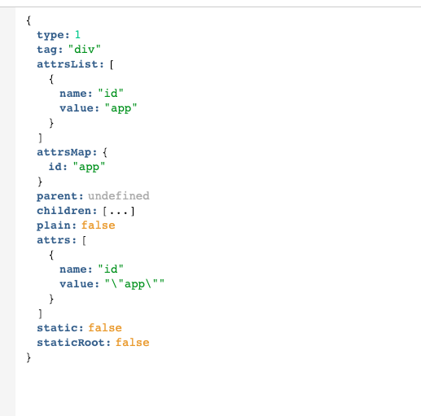
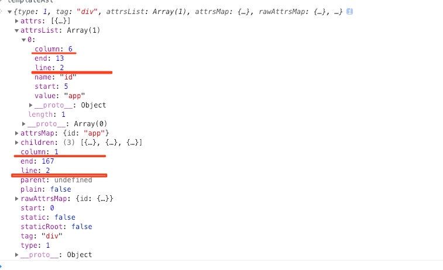

# vue-template-compiler-fake
😭为啥没有行信息，给 vue template 的 ast 加上行信息

vue-template-compiler 解析 template 出来的 ast 没有行信息，让我很忧桑😹，这里简单修改了 build.js 里面部分代码，加上了行和列信息

**这只是我的一个简单备份，没有发 npm，也不要轻易使用🤡，毕竟我是个鸽王🐦，**

官方的：

修改后：

